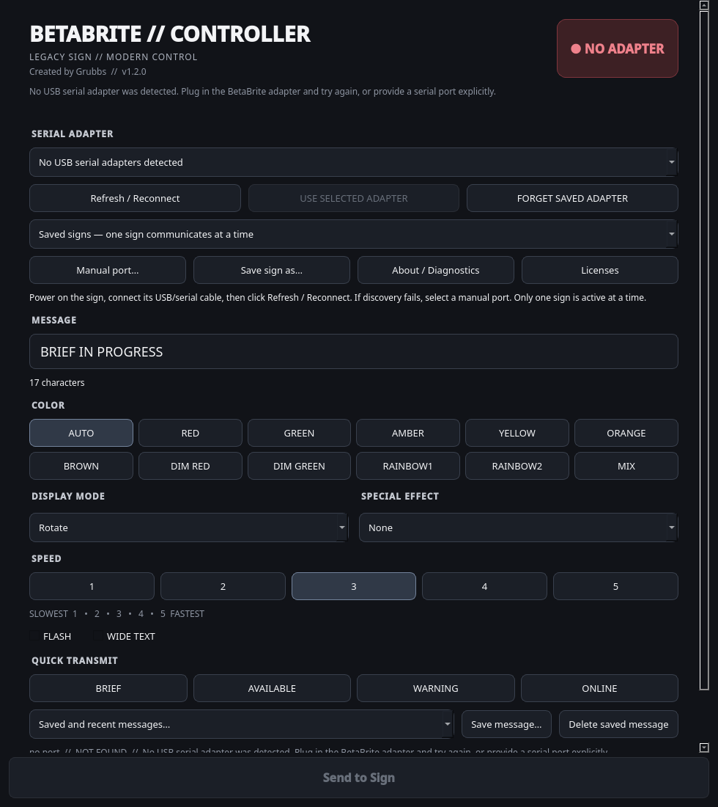

# BetaBrite Controller

BetaBrite Controller is a cross-platform desktop application for controlling compatible BetaBrite LED signs from Windows, macOS, and Linux.

Compose messages, choose colors and effects, save favorites, and manage named signs. Everything runs locally, with no telemetry. Desktop packages include Python and Qt; you do not need development tools.



## Download and install

Get your platform's installer from [GitHub Releases](https://github.com/grubbs-dev/betabrite-controller/releases). Release preparation currently targets **1.4.1**, continuing the existing version history. See [release validation](docs/RELEASE_VALIDATION.md) before treating an unreleased build as production-ready.

| Operating system | Download | Installation |
| --- | --- | --- |
| Windows 10/11 x64 | `BetaBrite-Controller-1.4.1-Windows-x64[-unsigned]-Setup.exe` | Open the installer, then launch from Start |
| macOS Apple Silicon | `betabrite-controller-1.4.1-macos-arm64[-unsigned].dmg` | Open the disk image and drag BetaBrite Controller to Applications |
| Linux x86_64 | `BetaBrite-Controller-1.4.1-Linux-x86_64.AppImage` | Allow execution in file Properties, then double-click |

Brackets indicate an optional filename suffix, not literal characters. Windows and macOS development builds without signing credentials are labeled `-unsigned`; do not assume they are signed or notarized. Intel Macs are not a release target. Linux builds target Ubuntu 24.04 or newer and comparable desktop distributions; AppImage does not remove system-library compatibility requirements.

[Installation details](docs/INSTALL.md) · [User guide](docs/USER_GUIDE.md) · [Troubleshooting](docs/TROUBLESHOOTING.md)

## Send your first message

1. Power on the sign and connect its USB-to-serial cable.
2. Open BetaBrite Controller and select your adapter. Use **Refresh / Reconnect**, or **Manual port…** if it is not listed.
3. Wait for READY, enter a message, and click **Send to Sign**.
4. Use **Save sign as…** to remember its hardware identity and friendly name.

READY means the serial port opened successfully. “Message sent” means the serial write completed. This protocol path provides no acknowledgment that the physical sign displayed the message.

The application remains usable without a sign attached. You can compose and save messages offline.

## Features

- USB adapter discovery, explicit port selection, reconnect, and remembered hardware identity
- Multiple named signs, with one sign active at a time
- Colors, display modes, special effects, speed 1–5, flashing and wide text
- Pixel Studio for drawing 90 x 7 BetaBrite-compatible pixel graphics, editing frames, previewing local animations, and saving `.bbpixel` artwork. Static physical graphics are validated on the tested BetaBrite/Alpha 213C-1 Series B after explicit graphics memory initialization.
- Live Mode for running framebuffer sources locally, including an original tiny runner demo and virtual benchmark diagnostics
- Saved messages, the latest 20 successful messages, and reusable presets
- Background transmission with duplicate-send protection
- Per-user preferences and bounded local diagnostic logs
- A CLI using the same controller and protocol as the desktop app

Messages use the existing ASCII encoding; other characters display as `?`. Alignment remains the established FILL behavior. The app does not offer unverified protocol commands or claim a universal sign-memory limit.

## Pixel Studio

Open **Pixel Studio** from the sidebar to draw custom SMALL DOTS graphics. One editor cell is one sign pixel. The default canvas is 90 columns by 7 rows for classic one-line BetaBrite-style signs, while the saved `.bbpixel` format records width, height, frame durations, loop metadata, and protocol-compatible colors.

Multi-frame artwork can be previewed locally. Static physical SMALL DOTS display is validated on the tested BetaBrite/Alpha 213C-1 Series B using DOTS file `D` and normal TEXT wrapper `B`, but only after the sign memory directory has been initialized for graphics. See [Pixel Studio protocol notes](docs/pixel-studio-protocol.md).

## Live Mode

Open **Live Mode** to run generated framebuffer sources through the local preview. The first source is an original tiny 7-pixel endless runner. Space or Up jumps, R restarts, and Escape stops Live Mode.

Live Mode separates game simulation from physical sign output. The preview can run smoothly while future hardware transports use a measured lower FPS. The static custom-graphics protocol writes SMALL DOTS files, and volatile sign storage has not been proven, so rapid physical framebuffer streaming is blocked to protect sign memory. The page clearly shows **VIRTUAL PREVIEW ONLY** rather than implying hardware output.

Use the virtual benchmark controls or `betabrite --live-benchmark-virtual` to measure scheduler/encoder behavior without hardware. See [Live Mode](docs/live-mode.md).

## Hardware

The repository records prior physical testing of an **Adaptive Micro Systems BetaBrite 213C-1, Series B**, with a **DSD TECH SH-RJ12C / Prolific PL2303GT** adapter (`067b:23a3`). Communication remains **9600 baud, 7 data bits, even parity, 1 stop bit, DTR off**.

Other compatible Alpha/BetaBrite signs and USB serial adapters can be selected, but require testing. Adapter discovery identifies serial hardware, not the sign model. Drivers come from the operating system or adapter manufacturer and are not bundled. See [hardware and wiring](docs/hardware.md).

## Troubleshooting

Open **About / Diagnostics** for the application version, selected port, detected USB adapters, and log location. If the sign is missing, check its power and cable, refresh, and select the correct port. Linux may require membership in the distribution's serial-access group; never make serial devices world-writable. Detailed [Windows, macOS, PL2303 and Linux guidance](docs/TROUBLESHOOTING.md) is available.

## Development

Use Python 3.13 and an isolated environment:

```bash
python -m venv .venv
# Linux/macOS:
source .venv/bin/activate
# Windows PowerShell instead:
# .venv\Scripts\Activate.ps1
python -m pip install --upgrade pip
python -m pip install -e ".[desktop]"
betabrite-desktop
python -m unittest discover -s tests -v
betabrite-desktop --smoke-test
betabrite --version
betabrite --list-ports
```

The smoke test creates the actual Qt window offscreen, loads packaged resources, round-trips isolated preferences, and enumerates serial devices without opening them.

Build on the target operating system:

```bash
python scripts/build-native.py --dry-run
python scripts/build-native.py
```

See [development](docs/DEVELOPMENT.md), [packaging and signing](docs/packaging.md), and the [release checklist](docs/RELEASING.md). GitHub Actions builds natively on Windows, macOS and Linux. A matching version tag triggers the gated release workflow. Do not tag until all release gates pass.

The historical GTK interface and Fedora installation scripts remain as compatibility references, outside the official desktop distribution. Existing local GTK work has not been overwritten. Qt is the authoritative desktop product; both interfaces and the CLI use the shared controller.

## Contributing and license

See [CONTRIBUTING.md](CONTRIBUTING.md) and [CHANGELOG.md](CHANGELOG.md). Report bugs with the app version, OS, adapter model, and relevant log excerpt; omit personal information.

Licensed under the [MIT License](LICENSE). Bundled third-party components retain their own licenses; see [third-party notices](THIRD_PARTY_NOTICES.md).
